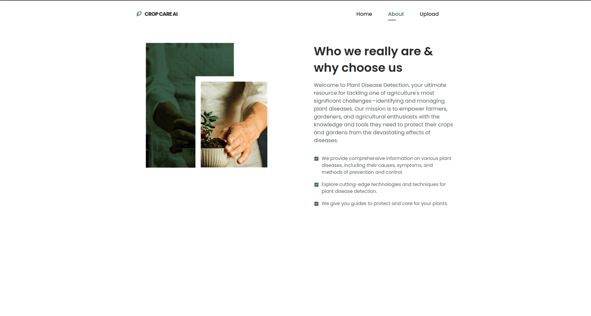
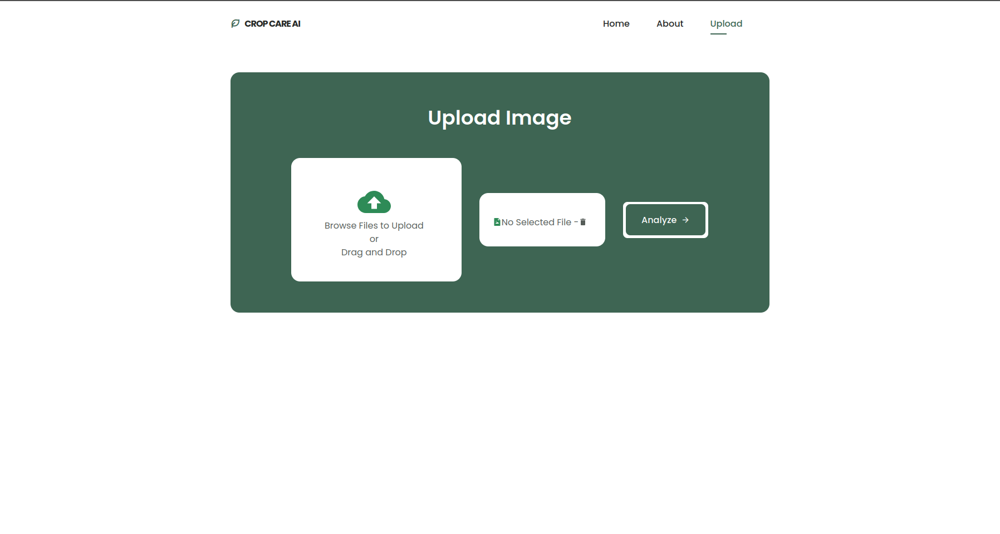

# CropCareAI

**CropCareAI** is a modern web application built with **ReactJS**, **React Router DOM**, **Axios**, and **Remix Icon**.  
It provides a clean and responsive user interface for an AI-powered crop health monitoring platform.

---

## Why ReactJS

- **Fast & Interactive:** Built with React for a smooth and dynamic user experience.  
- **Component-Based:** Modular structure for easy maintenance and scalability.  
- **Seamless Navigation:** Uses React Router DOM for single-page app navigation.  
- **API Ready:** Integrated with Axios for flexible API communication.  
- **Modern UI:** Styled with Remix Icons and responsive design principles.

---

## Technologies Used

| Technology | Purpose |
|-------------|----------|
| **ReactJS** | Front-end library for building interactive UIs |
| **React Router DOM** | Enables client-side routing |
| **Axios** | Handles API requests and data fetching |
| **Remix Icon** | Icon pack for elegant UI elements |
| **Vercel** *(optional)* | Hosting and deployment platform |

---

## Installation & Setup

### 1. Clone the Repository
```
git clone https://github.com/gowthamselvaraj327/cropcareai.git
cd cropcareai
```

### 2. Install Dependencies
```
npm install
```
### 3. Run the Application
```
npm start
```
Then open http://localhost:3000

## Screenshots

 - ### Home Page
    
 - ### About Page
    
 - ### File Upload Page
    

## Deployment

## Deployment (Vercel)
This application is deployed using Vercel for fast, scalable, and serverless hosting.

### Steps:
1. Push your code to GitHub.
2. Go to [Vercel](https://vercel.com/)
    - Login or Signup with your github account
3. Import your repository.
4. Deploy — Vercel automatically builds and hosts your app.


- **Live Demo:** [cropcareai](https://cropcareai-1w88v8qw2-gowthamselvaraj327s-projects.vercel.app/)
